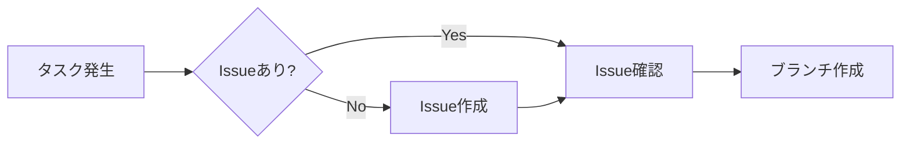
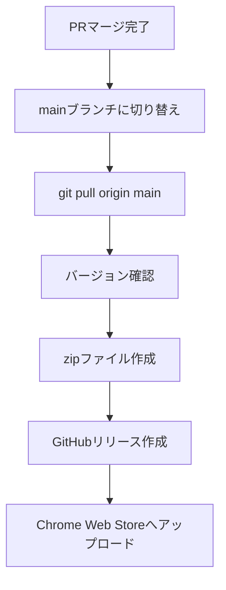

# Zenn Scrap TOC Extension - 開発ガイドライン

このドキュメントは、Zenn Scrap TOC Chrome拡張機能の開発における固有のルールとワークフローを定義します。
グローバルCLAUDE.md（~/.claude/CLAUDE.md）の規則に加えて、以下のプロジェクト固有のルールを適用します。

## 🎯 開発の基本原則

### Issue駆動開発の徹底
- **すべての開発作業はIssueに紐付ける**
- 作業開始前に必ずIssueを参照または作成
- Issueなしでの開発は禁止

## 📋 開発ワークフロー

### 1. Issue管理


#### Issue作成時のルール
- タイトルは日本語で記述
- ラベルを適切に設定（bug, enhancement, documentation等）
- 問題の説明、期待される動作、再現手順を明記

### 2. ブランチ戦略
```bash
# ブランチ命名規則
feature/{issue-number}-{description}  # 新機能
fix/{issue-number}-{description}       # バグ修正
docs/{issue-number}-{description}      # ドキュメント
perf/{issue-number}-{description}      # パフォーマンス改善

# 例
fix/1-exclude-details-headings
feature/3-mutation-observer-optimization
```

### 3. 開発フロー
1. **Issue選択**: 作業するIssueを選択
2. **ブランチ作成**: `git checkout -b {branch-name}`
3. **開発実施**: コード変更とテスト
4. **バージョン更新**: manifest.jsonとcontent.jsのバージョンをインクリメント
5. **コミット**: Conventional Commits形式でコミット
6. **PR作成**: `gh pr create`でPRを作成
7. **レビュー依頼**: ユーザーに確認とマージを依頼

### 4. バージョン管理

#### セマンティックバージョニング（SemVer）
```
MAJOR.MINOR.PATCH

MAJOR: 後方互換性のない変更
MINOR: 後方互換性のある機能追加
PATCH: 後方互換性のあるバグ修正
```

#### バージョン更新箇所
1. `manifest.json` - "version"フィールド
2. `content.js` - ヘッダーコメントと console.log、panel.dataset.version

#### バージョン更新の目安
- **バグ修正**: PATCH（0.1.1 → 0.1.2）
- **機能追加**: MINOR（0.1.2 → 0.2.0）
- **大規模変更**: MAJOR（0.2.0 → 1.0.0）

### 5. PR作成とマージ

#### PR作成時の必須項目
```markdown
## 概要
Issue #{issue-number} の内容を簡潔に説明

## 変更内容
- 主な変更点を箇条書き

## テスト項目
- [ ] 基本動作の確認
- [ ] エッジケースの確認
- [ ] 既存機能への影響確認

Closes #{issue-number}
```

#### マージ後の処理
```bash
# 1. mainブランチに切り替えて最新を取得
git checkout main && git pull origin main

# 2. 作業完了をユーザーに報告
```

### 6. リリース作業

#### リリースフロー


#### Zipファイル作成
```bash
# バージョン番号を含むzipファイル名
zip -r zenn-scrap-toc-v{version}.zip . \
  -x "*.git*" \
  -x "*.DS_Store" \
  -x "CLAUDE.md" \
  -x "*.zip" \
  -x "node_modules/*" \
  -x ".github/*"

# 例: zenn-scrap-toc-v0.2.0.zip
```

#### GitHubリリース作成
```bash
# GitHubでリリースを作成
gh release create v{version} \
  --title "Release v{version}" \
  --notes "リリースノートの内容" \
  zenn-scrap-toc-v{version}.zip

# 例
gh release create v0.2.0 \
  --title "Release v0.2.0" \
  --notes "### 🚀 パフォーマンス改善\n- MutationObserverによる高速化" \
  zenn-scrap-toc-v0.2.0.zip
```

## 📁 プロジェクト構造

```
zenn-scrap-toc/
├── manifest.json       # 拡張機能マニフェスト（バージョン管理）
├── content.js         # メインスクリプト（バージョン管理）
├── styles.css         # スタイルシート
├── icons/            # アイコンファイル
├── README.md         # プロジェクト説明
├── CLAUDE.md         # このファイル（開発ガイドライン）
├── PRIVACY_POLICY.md # プライバシーポリシー
└── docs/            # Chrome Web Store用ドキュメント
```

## 🔄 典型的な開発セッション

```bash
# 1. セッション開始時
gh issue list --state open  # Open Issueを確認

# 2. Issue選択後
git checkout -b fix/5-scroll-spy-bug  # ブランチ作成

# 3. 開発完了後
git add .
git commit -m "fix: スクロールスパイの不具合を修正"
git push -u origin fix/5-scroll-spy-bug
gh pr create --base main

# 4. マージ後
git checkout main && git pull origin main

# 5. リリース作業
zip -r zenn-scrap-toc-v0.2.1.zip . -x "*.git*" -x "*.DS_Store" -x "CLAUDE.md" -x "*.zip"
gh release create v0.2.1 --title "Release v0.2.1" zenn-scrap-toc-v0.2.1.zip
```

## ⚠️ 重要な注意事項

1. **Issueなしでの開発は禁止** - 小さな修正でも必ずIssueを作成
2. **バージョン更新を忘れない** - manifest.jsonとcontent.jsの両方
3. **PRには必ずCloses #XXを含める** - Issue自動クローズのため
4. **マージ後は必ずmainをpull** - 次の開発の準備
5. **リリース時はzipとGitHub Releaseの両方を作成**

## 📝 コミットメッセージ規約

プロジェクトではConventional Commitsを使用：
- `feat:` 新機能
- `fix:` バグ修正
- `perf:` パフォーマンス改善
- `docs:` ドキュメント
- `chore:` その他の変更
- `refactor:` リファクタリング

## 🚀 Chrome Web Storeへの公開

リリース作成後、Chrome Web Storeの開発者ダッシュボードから：
1. 新しいバージョンのzipファイルをアップロード
2. 変更内容の説明を記載
3. 審査を申請

---

*最終更新: 2025-11-26*
*プロジェクトバージョン: 0.2.0*